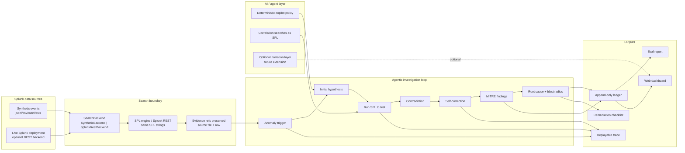

# Architecture Diagram

This project uses a deterministic agent loop over Splunk-shaped data. The
offline backend executes real SPL over synthetic events; the live backend seam
uses the same SPL strings against Splunk REST when `SPLUNK_URL` and
`SPLUNK_TOKEN` are supplied.

## Data Flow

1. Events are loaded read-only from synthetic case directories or live Splunk.
2. The copilot chooses SPL searches for the incident hypothesis.
3. Search results preserve source evidence refs through aggregation.
4. The agent rejects contradicted hypotheses, writes MITRE-mapped findings, and
   produces root cause, blast radius, and remediation.
5. The ledger, trace, eval report, and dashboard expose the full reasoning path.

## Splunk Interaction

- Offline: `SyntheticBackend` runs real SPL locally for reproducible judging.
- Live: `SplunkRestBackend` submits the same SPL to Splunk REST search jobs.
- The repository includes mocked REST tests so the live seam is verified without
  storing any Splunk credentials.
